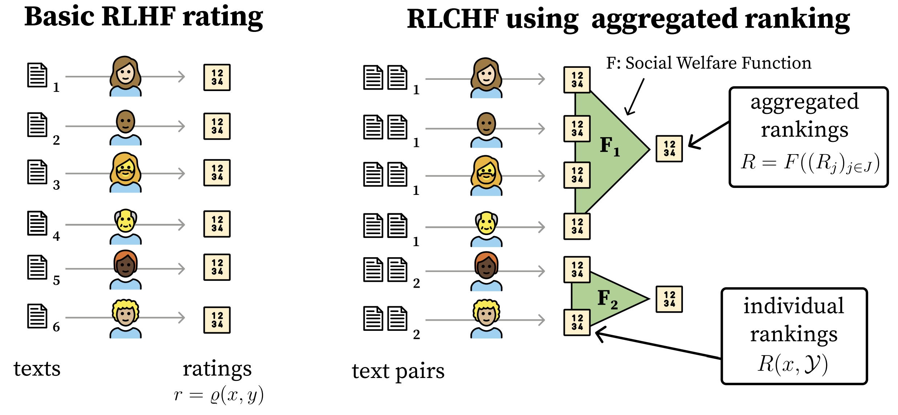

# Embrace Diversity: RLCHF with Synthetic Rankings Generation

## Introduction
Aligning Large Language Models (LLMs) with human values is a key challenge in AI research. **Reinforcement Learning from Human Feedback (RLHF)** [Ouyang et al., 2022](#references) is a widely used approach to align models with human preferences. However, RLHF may struggle to capture diverse and conflicting perspectives.

Building upon the work from **"Social Choice Should Guide AI Alignment in Dealing with Diverse Human Feedback"** [Conitzer et al., 2024](#references), this project explores **Reinforcement Learning from Choice-based Human Feedback (RLCHF)** as an alternative approach to improve alignment by aggregating diverse feedback.


*Figure: RLCHF process incorporating a Social Welfare Function \(F\) to aggregate preferences (adapted from Conitzer et al., 2024).*

## Goals
RLCHF was conceptually introduced by [Conitzer et al., 2024](#references) to enhance diversity representation in reinforcement learning for LLMs. While the method theoretically improves fairness, accuracy, and societal acceptance, it has not yet been implemented. Additionally, ranking multiple responses per prompt introduces high computational costs.

To address these challenges, we propose an alternative approach where preferences are generated by a diverse set of LLMs, **each persona-prompted to simulate a wide range of social perspectives**.

### Main Objectives:
- **Generate RLCHF-style rankings** by seeding models with personas (e.g., from **PersonaHub** [Ge et al., 2024](#references)) to simulate diverse human feedback.
- **Benchmark and evaluate the model** on performance and social bias metrics compared to standard RLHF post-training, incorporating human evaluation to validate alignment with diverse values.

## Methodology

### Data and Ranking Generation
- Utilize existing **RLHF datasets** for fine-tuning.
- Generate RLCHF rankings using **LLMs seeded with diverse personas** (manually crafted or sampled from datasets).
- Experiment with **different Social Welfare Functions** to optimize ranking aggregation.
- Reference existing AI feedback integration methods, as explored in [Bai et al., 2022](#references), [Kim et al., 2023](#references), and others.
- Leverage curated **RLHF datasets** from [this repository](https://github.com/glgh/awesome-llm-human-preference-datasets).

### Training
- Fine-tune models using **both RLHF and RLCHF**.
- Apply **Proximal Policy Optimization (PPO)** [Schulman et al., 2017](#references) and/or **Direct Preference Optimization (DPO)** [Rafailov et al., 2024](#references) for reinforcement learning optimization.

### Evaluation
- Compare performance using **standard RLHF benchmarks** (e.g., **RewardBench** [Lambert et al., 2024](#references)).
- Measure bias and diversity using established **social bias benchmarks**.
- Conduct **human evaluations** to assess alignment quality.
- Implement RLCHF **with real annotators in a specific application**, allowing comparative analysis to evaluate real-world generalization.

## Expected Outcomes
- A **comparative analysis** of RLHF vs. RLCHF models on **performance, bias mitigation, and alignment with diverse preferences**.
- Insights into how **RLCHF can improve inclusivity and robustness** in AI systems.
- An understanding of the **trade-offs between performance and social alignment** in LLM training.

## Installation

### Requirements
- Python 3.8+
- CUDA-compatible GPU (recommended for model training/inference)
- At least 16GB RAM

### Setup

1. **Clone the repository:**
   ```bash
   git clone https://github.com/QuentinFitteRey/RLCHF.git
   cd RLCHF
   ```

2. **Create a virtual environment:**
   ```bash
   # Using conda
   conda create -n rlchf python=3.9
   conda activate rlchf
   
   # Or using venv
   python -m venv rlchf
   source rlchf/bin/activate  # On Windows: rlchf\Scripts\activate
   ```

3. **Install dependencies:**
   ```bash
   pip install -r requirements.txt
   ```

4. **Set up environment variables:**
   Create a `.env` file in the root directory:
   ```bash
   # Optional: Hugging Face token for accessing gated models
   HF_TOKEN=your_hugging_face_token_here
   
   # Data directory (will be created automatically)
   DATA_DIR=./data
   ```

## Usage

### Setting up Python Path

Before running any scripts, set the Python path to the repository root:

```bash
export PYTHONPATH=.
```

### 1. Generate Diverse Personas (Optional)

The repository includes pre-generated personas, but you can create new ones:

```bash
python scripts/generate_personas.py \
    --input-file "data/personas/sample_personas.jsonl" \
    --output-file "data/personas/my_generated_personas.jsonl" \
    --sample-size 500 \
    --model-name "meta-llama/Llama-3.1-70B-Instruct"
```

### 2. Dataset Generation with Personas

Generate preference data using diverse personas:

```bash
python prompt/dataset_generation.py \
    --data_path "path/to/your/dataset.parquet" \
    --personas_path "data/personas/generated_personas.jsonl" \
    --model "google/gemma-3-27b-it" \
    --output_path "data/preferences/generated_preferences.jsonl" \
    --num_personas 20 \
    --num_samples 1000 \
    --temperature 0.7
```

### 3. Model Training

#### Direct Preference Optimization (DPO)
```bash
python training/train_dpo.py \
    --model_name "meta-llama/Llama-3.1-8B-Instruct" \
    --dataset_path "data/preferences/generated_preferences.jsonl" \
    --output_dir "outputs/dpo_model" \
    --num_epochs 3 \
    --learning_rate 5e-6
```

#### Supervised Fine-tuning (SFT)
```bash
python training/train_sft.py \
    --model_name "meta-llama/Llama-3.1-8B-Instruct" \
    --dataset_path "data/preferences/generated_preferences.jsonl" \
    --output_dir "outputs/sft_model" \
    --num_epochs 3 \
    --learning_rate 1e-5
```

### 4. Evaluation

See the [Evaluation README](eval/README.md) for detailed instructions on evaluating your trained models on BBQ. For additional benchmarks, we recommend using [lm-evaluation-harness](https://github.com/EleutherAI/lm-evaluation-harness).

## Project Structure

```
RLCHF/
├── prompt/                 # Data generation and prompting utilities
│   ├── dataset_generation.py    # Main script for generating preference data
│   ├── generate_prompt.py       # Prompt generation utilities
│   ├── prompts.py               # Prompt templates
│   └── utils.py                 # Helper functions
├── training/              # Model training scripts
│   ├── train_dpo.py            # Direct Preference Optimization
│   ├── train_sft.py            # Supervised Fine-tuning
│   └── utils.py                # Training utilities
├── eval/                  # Evaluation scripts and benchmarks
│   ├── benchmarks/             # Evaluation benchmarks
│   └── configs/                # Evaluation configurations
├── assets/                # Images and documentation assets
├── requirements.txt       # Python dependencies
├── .env.example          # Environment variables template
└── README.md             # This file
```

## Data Format

### Personas Format (JSONL)
```json
{"persona": "A 30-year-old software engineer from California", "sex": "Male", "age": 30, "nationality": "American", "social_class": "Middle class"}
{"persona": "A 45-year-old teacher from rural Texas", "sex": "Female", "age": 45, "nationality": "American", "social_class": "Working class"}
```

### Preference Data Format (JSONL)
```json
{"prompt": "What is the best approach to...", "chosen": "Response A", "rejected": "Response B", "persona": "A 30-year-old...", "sex": "Male", "age": 30}
```

## Configuration

Key parameters can be configured:

- **Model Selection**: Supports models from Hugging Face Hub (Llama, Gemma, Qwen, etc.)
- **Persona Diversity**: Number and types of personas used for preference generation
- **Training Parameters**: Learning rates, batch sizes, number of epochs
- **Evaluation Metrics**: Custom metrics for bias and performance assessment


## References
1. Ouyang, Z., et al. (2022). "Training language models to follow instructions with human feedback."
2. Conitzer, V., et al. (2024). "Social Choice Should Guide AI Alignment in Dealing with Diverse Human Feedback."
3. Ge, T., et al. (2024). "Scaling Synthetic Data Creation for AI Alignment."
4. Bai, Y., et al. (2022). "Constitutional AI: Harmlessness from AI Feedback."
5. Kim, Y., et al. (2023). "Aligning AI Models with Human Values Using RLHF."
6. Schulman, J., et al. (2017). "Proximal Policy Optimization Algorithms."
7. Rafailov, R., et al. (2024). "Direct Preference Optimization for Language Models."
8. Lambert, T., et al. (2024). "RewardBench: Evaluating Reward Models for RLHF."

---

## Contact & Contribution
If you're interested in contributing, feel free to submit a **pull request** or reach out to the authors:
- **Quentin FITTE-REY**
- **Romain FROGER**

For questions or collaborations, please open an **issue** in the GitHub repository!

---

**License:** This project is released under the MIT License.
